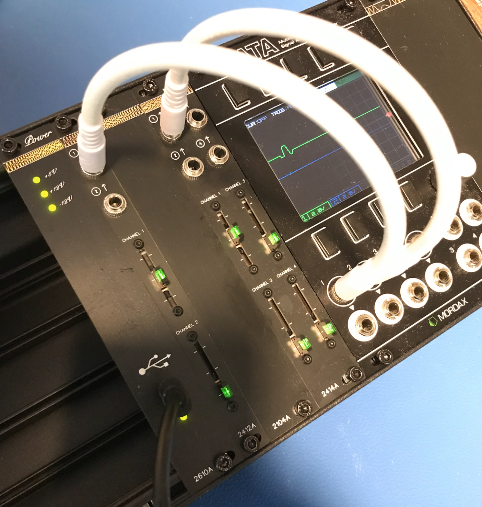

# Nanomia Outs Dual Eurorack Module

2412A module shown second to the left.

## Project Overview
The Nanomia Outs Dual module provides two CV slider controls. Outputs can be configured to be between 0 - 5V, 0 - 12V or -12 - 12V using configuration switches. SMT resistors can be replaced for other ranges.

