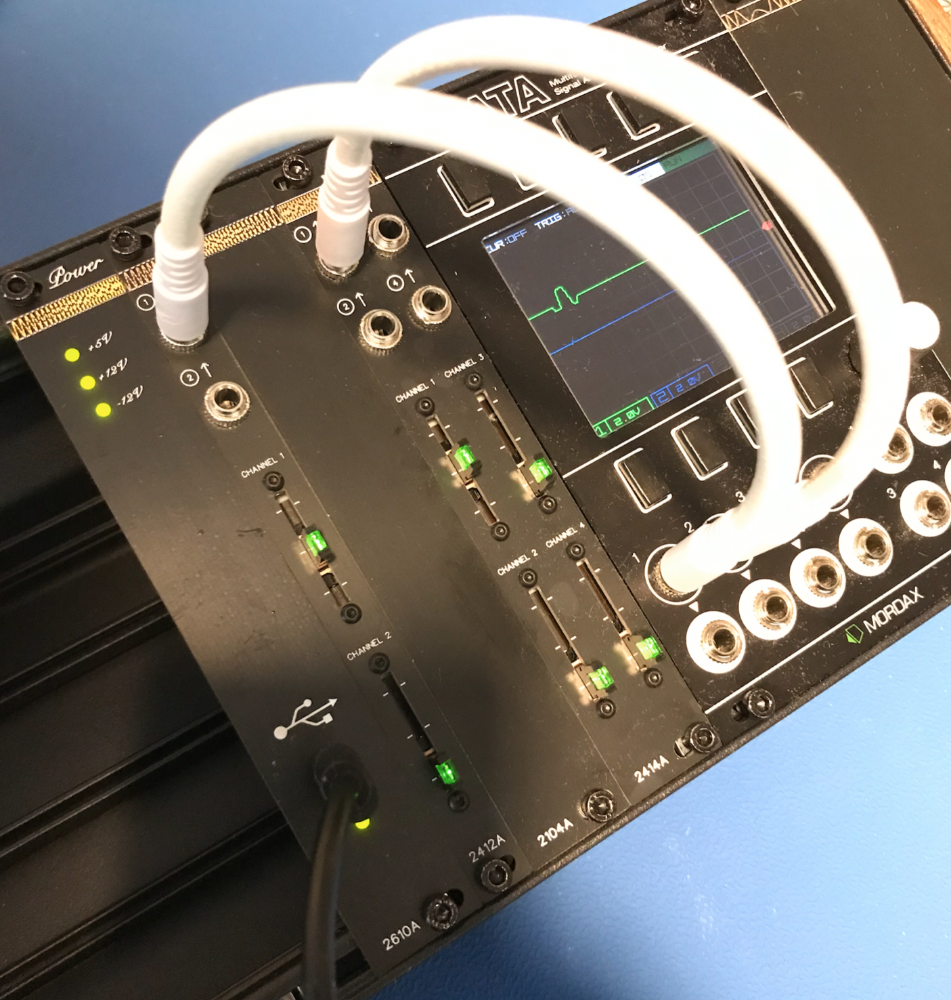

# Nanomia Outs Quad Eurorack Module

2414A module shown in the middle.

## Project Overview
The Nanomia Outs Quad module provides four CV slider controls. Outputs can be configured to be between 0 - 5V, 0 - 12V or -12 - 12V using configuration switches. SMT resistors can be replaced for other ranges.

This module also uses two 2412-0201 and 2412-0202 PCBs.