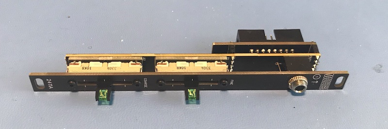

These are my open source Eurorack modules. Each of these designs are in varying stages of completion, and I will upload updated pictures, design files and software source code as they progress.

| Module Overview | Status |
|-|-|
| **2411A Adjustable CV output**    This module allows a user to select an output voltage by adjusting the corse and fine sliders. Output voltage ranges are selectable by changing the positions of two switches on the rear. Voltage output ranges are 12V to -12V, 12V to 0V, 5V to -12V and 5V to 0V. | Under development |

P.S. Cnidarians rule!