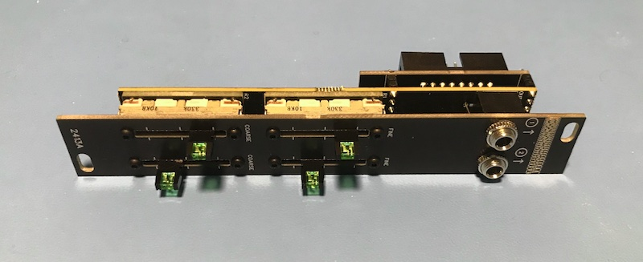
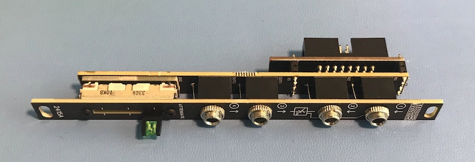
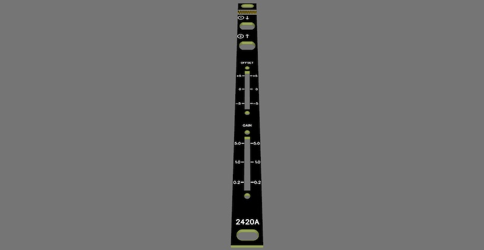
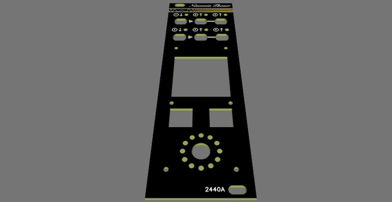

This repository contains design files and software source code for my open source Eurorack modules. Each of these designs are in varying stages of completion, and will be updated as further progress is made.

| Module Overview | Status |
|-|-|
| **2411A Adjustable CV output**    This module allows a user to select an output voltage by adjusting the corse and fine adjust sliders. Output voltage ranges are selectable by changing the positions of two switches on the rear. Voltage output ranges are 12V to -12V, 12V to 0V, 5V to -12V and 5V to 0V. | Under development |
| **2412A Dual Adjustable CV output**    This module allows a user to select two output voltages by adjusting a corse adjust slider for each output. Output voltage ranges are selectable by changing the positions of two switches on the rear. Voltage output ranges are 12V to -12V, 12V to 0V, 5V to -12V and 5V to 0V. | Final testing |
| **2413A Voltage Controlled Amplifier**    This module mixes two inputs, then feeds the mix through a voltage-controlled amplifier. The offset of the CV input can be adjusted using a slider, or the slider can be used to adjust the amplification without a CV input connected. | Under development |
| **2414A Quad Adjustable CV output**    This module allows a user to select four output voltages by adjusting a corse adjust slider for each output. Output voltage ranges are selectable by changing the positions of two switches on the rear. Voltage output ranges are 12V to -12V, 12V to 0V, 5V to -12V and 5V to 0V. | Final testing |
| **2415A Quad Adjustable attenuator**    This module mixes two inputs, then feeds the mix through an adjustable attenuator, and provides two buffered outputs. The degree of attenuation is controlled using a slider. | Under development |
| **2420A Adjustable gain amplifier**    This module provides variable amplification, with both the output voltage offset and the amplification being adjustable using two sliders. | Under development |
| **2432A PPM levels display**    This module provides two peak programme meters (PPM) for audio signal level visualization and monitoring. Different dynamics and display styles can be selected using a DIP switch on the inside of the module. | Final testing |
| **2440A Phasor display**    This module monitors two audio inputs and displays the phase angle between them. Operating modes can be selected and settings can be adjusted using two buttons and a encoder, with the phase angle and other visualizations displayed on a small LCD. | Final testing |
| **2450A Et Seq Sequencer**    This module provides four channel CV sequencing. CV values can be "learned" from a CV input or manually input using a joystick. The sequencer can be started and stopped using a gate input, and can use an internal clock or run off an external clock. Both gate and CV outputs are provided for each channel. Up to 32 different values can be defined and displayed per bar, and multiple bars can be chained. | Early prototyping |
| **2460A Matrix Switcher**    This module provides ten inputs and ten outputs, and allows any input to be routed to any output. All outputs are buffered, and an input can be routed to multiple outputs. Two utility mixers are provided, each allowing up to three inputs to be mixed to a routable output. Routing is configured by using the four buttons, and the current configuration is displayed on a 16x16 matrix display. Routing configurations can be saved and restored. Rear connectors allow an additional four inputs and outputs to be connected to other modules, and allows multiple matrix modules to be chained together. | Under development |
| **2470A Gateway**    This module enables programable gate manipulation, including clock generation, delay, and various logic operations. Four buttons allow the operating mode to be changed, and gate outputs to be enabled or disabled. The module is configurable via a front-panel USB-C connector. | Final testing |
| **2480A Mixes**    This module provides dual eight-channel mixing with per-channel and output CV controlled amplification. Input levels can be adjusted using a per-input slider, and output levels can be adjusted using an output level slider. Audio or CV levels are displayed on two channel meters. This module can be used as a stereo mixer, or to route different signals to different processing chains based on gate or CV input control. | Early prototyping |

Also related to Eurorack designs, I also have a project that I'm working on that uses the gate signal to encode digital information in order to allow bidirectional module-to-module communication in a backwards-compatible way. I plan to document and demonstrate electrical signalling, a low-level protocol for bidirectional communication, and a higher-level protocol for module and topology discovery, MIDI tunnelling, setting control, and bulk configuration transfer.

P.S. Cnidarians rule!
